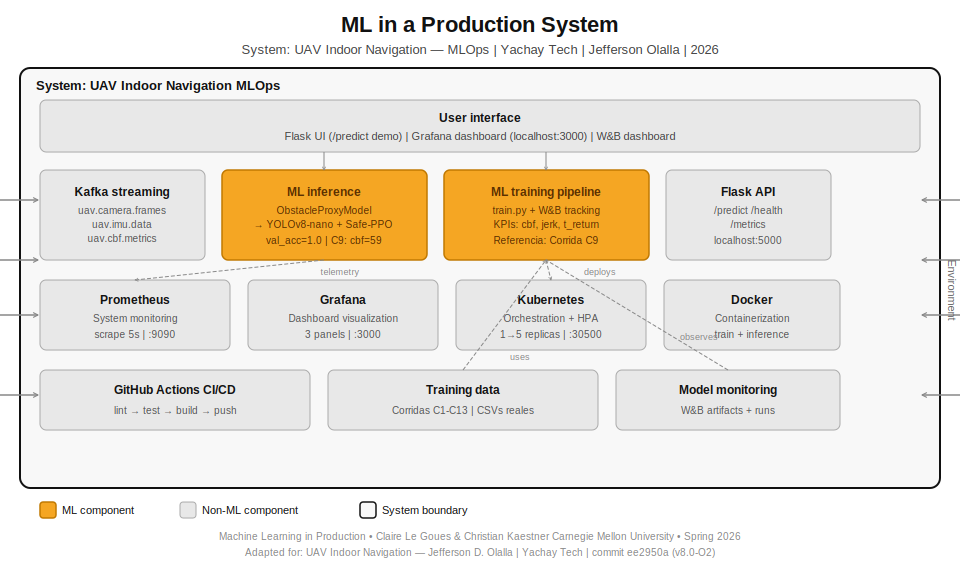

# Arquitectura del Sistema – MLOps para UAV Indoor

## Visión General

El sistema sigue la arquitectura de referencia de *Machine Learning in Production*,
adaptada para un robot aéreo en entornos interiores sin GPS. La inspiración principal
proviene de la **arquitectura Apollo** (estándar en vehículos autónomos terrestres,
Baidu/U. de Toronto), adaptada sistemáticamente al dominio UAV indoor GPS-denied.

## Mapeo Apollo → UAV Indoor

| Componente Apollo | Equivalente en este sistema | Tipo de adaptación |
|-------------------|----------------------------|---------------------|
| GPS + HD Map | VIO + EKF2 (gz_vio_bridge) | Sustitución |
| Camera + LiDAR | Monocular + IMU + percepción sintética | Simplificación |
| Lane Detection | Corredor virtual Z bounds (C5) | 2D → 3D |
| Traffic Light | GOAL marker + StopZoneHandler | Adaptación conceptual |
| Prediction (Vehicle) | RNN LSTM (C4) | Mismo principio |
| EM Planner (MPC) | N-MPC Acados (C9) | Sustitución |
| Safety Fallback | CBF + confidence gate + watchdog | Extensión |
| *No existe en Apollo* | MLOps: Prometheus + W&B + GitHub Actions | Contribución original |

## Capas de la Arquitectura (7 Capas)

### Capa 1 — Fuentes de Datos
- **Simulador Gazebo + PX4:** Genera flujo de video y telemetría UAV
- **Dataset pre-grabado:** Para demostración MLOps sin dependencia de Gazebo
- Equivale a la capa de sensores de Apollo (Camera + LiDAR + GPS)

### Capa 2 — Streaming (Apache Kafka)
- **Topic `uav.camera.frames`** ↔ ROS2 `/camera/image_raw`
- **Topic `uav.imu.data`** ↔ ROS2 `/mavros/imu/data`
- **Topic `uav.cbf.metrics`** ↔ KPIs Control Barrier Function en tiempo real
- Producer: 10 fps simulados | Consumer: inferencia en tiempo real

### Capa 3 — Inferencia (Docker + Flask)
- **`/predict`:** Recibe frame base64, retorna obstacle_detected + confidence + CBF
- **`/health`:** Liveness probe para Kubernetes
- **`/metrics`:** Scraping Prometheus cada 5s
- Modelo: ObstacleProxyModel (proxy de YOLOv8-nano + Safe-PPO)

### Capa 4 — Monitoreo de Modelo (Weights & Biases)
- Logging automático: loss, accuracy, KPIs de tesis por época
- Artefacto versionado: `obstacle-proxy-model` (best_val_acc=1.0)
- Referencia experimental: Corrida C9 — 4/6 KPIs cumplidos
- Proyecto W&B: `mlops-uav-indoor` (models-universidad-yachay-tech)

### Capa 5 — Monitoreo de Sistema (Prometheus + Grafana)
- Métricas: `uav_frames_total`, `uav_inference_latency_seconds`,
  `uav_cbf_activations_total`, `uav_obstacle_detected_total`
- Dashboard Grafana: 3 paneles en tiempo real
- Scrape interval: 5s | Retención: 7 días

### Capa 6 — Orquestación (Kubernetes / Minikube)
- Deployment: 2 réplicas base → HPA hasta 5 réplicas
- Service: NodePort para acceso externo
- Justificación HPA: múltiples UAVs simultáneos en subestación CENACE
- Liveness + readiness probes via `/health`

### Capa 7 — Integración Continua (GitHub Actions)
- Pipeline: lint → test `/predict` → test `/metrics` → build → push
- Trigger: push a `main`
- Badge de estado en README

## Diagrama del Sistema
┌─────────────────────────────────────────────────────────────────────┐
│                     SISTEMA MLOPS - UAV INDOOR                       │
│                  (Adaptación Arquitectura Apollo)                     │
└─────────────────────────────────────────────────────────────────────┘
┌──────────────────┐   ┌───────────────────┐   ┌─────────────────────┐
│  CAPA 1          │   │  CAPA 2           │   │  CAPA 3             │
│  DATA SOURCE     │   │  KAFKA STREAMING  │   │  INFERENCE SERVICE  │
│                  │   │                   │   │                     │
│  Gazebo + PX4 ───┼──▶│  uav.camera.frames│──▶│  Flask /predict     │
│  (UAV sim)       │   │  uav.imu.data     │   │  Flask /health      │
│                  │   │  uav.cbf.metrics  │   │  Flask /metrics     │
│  Dataset ────────┼──▶│                   │   │  ObstacleProxy      │
│  pre-grabado     │   │  Producer 10fps   │   │  Model              │
└──────────────────┘   │  Consumer→infer   │   └──────────┬──────────┘
└───────────────────┘              │
▼
┌──────────────────┐   ┌───────────────────┐   ┌─────────────────────┐
│  CAPA 6          │   │  CAPA 5           │   │  CAPA 4             │
│  KUBERNETES      │   │  PROMETHEUS       │   │  W&B MONITORING     │
│                  │   │  + GRAFANA        │   │                     │
│  Deployment ─────┼───│  scrape /metrics  │   │  mlops-uav-indoor   │
│  HPA 1→5 rep.    │   │  Dashboard 3      │   │  KPIs tesis         │
│  Service NodePort│   │  paneles          │   │  Artefactos         │
│  Liveness probe  │   │  uav_frames       │   │  best_model.pt      │
└──────────────────┘   │  uav_latency      │   └─────────────────────┘
│  uav_cbf          │
└───────────────────┘
┌─────────────────────────────────────────────────────────────────────┐
│  CAPA 7 — CI/CD (GitHub Actions)                                     │
│  lint → test /predict → test /metrics → build docker → push → deploy│
└─────────────────────────────────────────────────────────────────────┘
▲ Feedback loop — investigación
     └── CBF + N-MPC | StopZoneHandler | KPIs (jerk, t_return)
## Conexión con el Proyecto de Investigación

| Componente investigación | Integración MLOps |
|--------------------------|-------------------|
| CBF + N-MPC (Safety) | `uav_cbf_activations_total` en Prometheus |
| StopZoneHandler | Confidence gate en `/predict` |
| KPIs (jerk, t_return, cbf_total) | Exportados a W&B + Prometheus |
| Corrida C9 (4/6 KPIs) | Referencia en W&B run summary |
| YOLOv8-nano + Safe-PPO | Reemplaza ObstacleProxyModel en producción |

## Alineación con Fundamentals of Engineering AI-Enabled Systems

| Dimensión | Implementación |
|-----------|----------------|
| **Holistic system view** | IA (modelo) + no-IA (Kafka, K8s, Prometheus, GitHub Actions) |
| **Architecture + design** | 7 capas Apollo-UAV, deployment architecture documentada |
| **Telemetry, monitoring** | Prometheus + Grafana + W&B en tiempo real |
| **Quality assurance** | Tests automatizados en CI + health checks |
| **Operations / MLOps** | Docker + K8s + GitHub Actions + W&B |
| **Responsible AI** | CBF safety + reproducibilidad + secrets management |

---

**Autor:** Jefferson D. Olalla Delgado — Yachay Tech
**Fecha:** 22 de abril de 2026
**Repositorio:** https://github.com/JeffersonOl/mlops_uav

---

## ML in a Production System (Framework CMU)

Siguiendo el framework de *Machine Learning in Production* (Carnegie Mellon University,
Claire Le Goues & Christian Kaestner, Spring 2026):

### Componentes ML (naranja) — solo 2

| Componente | Archivo | Descripción |
|-----------|---------|-------------|
| **ML inference** | `inference/app.py` | ObstacleProxyModel → proxy de YOLOv8-nano + Safe-PPO |
| **ML training pipeline** | `training/train.py` | Entrenamiento + W&B KPIs (cbf, jerk, t_return) |

### Componentes no-ML (gris) — infraestructura que rodea al modelo

| Componente | Tecnología | Rol |
|-----------|-----------|-----|
| User interface | Flask UI + Grafana + W&B | Visualización y demo |
| Data streaming | Apache Kafka | 3 topics replicando ROS2 |
| Flask API | Python Flask | /predict /health /metrics |
| System monitoring | Prometheus + Grafana | Telemetría en tiempo real |
| Orchestration | Kubernetes + HPA | Escalado 1→5 réplicas |
| Containerization | Docker | Portabilidad |
| CI/CD | GitHub Actions | lint→test→build→push |
| Training data | Corridas C1-C13 | CSVs reales de Gazebo |
| Model monitoring | W&B artifacts | Versionado de modelos |

### Por qué esto importa

La mayoría de tesis UAV tienen solo el componente ML (naranja).
La mayoría de tesis MLOps tienen solo la infraestructura (gris).
Este sistema tiene ambos — conectados con evidencia real de 13 corridas
de simulación, 7 fixes documentados y KPIs medidos (commit ee2950a, v8.0-O2).
