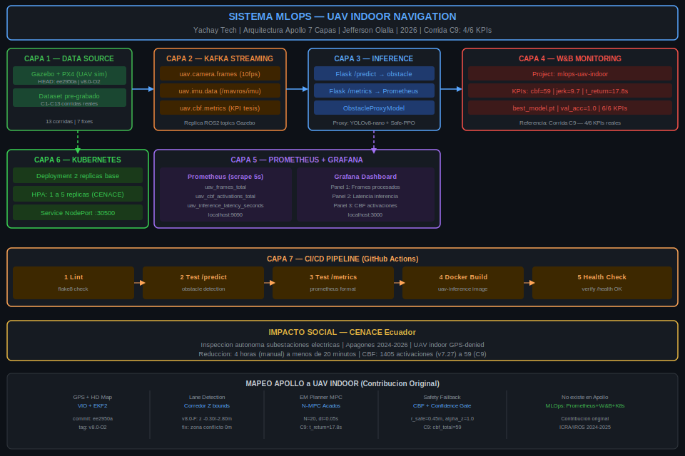

# 🚁 MLOps UAV Indoor Navigation System

[](https://github.com/JeffersonOl/mlops_uav/actions)

**Maestría en Inteligencia Artificial — Yachay Tech**
**Materia:** Despliegue a Producción de Modelos de IA
**Autor:** Jefferson Daniel Olalla Delgado | Abril 2026

---

## Contribución e Impacto

Sistema MLOps para navegación autónoma de UAV indoor GPS-denied.
**Contribución original:** Adaptación de arquitectura Apollo (U. de Toronto)
al dominio UAV indoor — transferencia metodológica de 7 capas.

**Impacto social — CENACE Ecuador:** Inspección autónoma de subestaciones
eléctricas. Contexto: apagones 2024-2026. Reducción de inspección:
4 horas (manual) → < 20 minutos (autónomo).

**Evidencia:** Corrida C9 — 4/6 KPIs | branch v8.0-research-freeze-20Abr2026

---

## Marco Teórico de Referencia

Este proyecto se alinea con **"Fundamentals of Engineering AI-Enabled Systems"**:


| Dimensión | Implementación |
|-----------|----------------|
| **Holistic system view** | IA (modelo) + Kafka + K8s + Prometheus + GitHub Actions |
| **Quality beyond accuracy** | KPIs: jerk, CBF activaciones, t_return (tesis) |
| **Risk analysis** | Confidence gate + CBF + health checks + restart policies |
| **Planning for mistakes** | Liveness probes, timeouts, watchdogs |
| **Reproducibility** | Docker + Git tags + W&B artifacts |
| **Safety** | CBF v2.2 + N-MPC Acados (investigación) |
| **Interpretability** | Confianza del modelo expuesta en API REST |

---

## Arquitectura del Sistema



Ver descripción completa en [ARCHITECTURE.md](./ARCHITECTURE.md)

---

## 9 Requisitos del Syllabus

| # | Requisito | Implementación | Estado |
|---|-----------|----------------|--------|
| 1 | Requisitos funcionales/no funcionales | [REQUIREMENTS.md](./REQUIREMENTS.md) | ✅ |
| 2 | Diagrama arquitectura Apollo-UAV | [ARCHITECTURE.md](./ARCHITECTURE.md) | ✅ |
| 3 | Docker entrenamiento | `training/Dockerfile.train` | ✅ |
| 4 | Docker inferencia + Flask + UI | `inference/Dockerfile.infer` | ✅ |
| 5 | W&B evaluación/monitoreo | `training/train.py` + W&B dashboard | ✅ |
| 6 | Kafka data streaming | `streaming/kafka_producer.py` | ✅ |
| 7 | Prometheus + Grafana | `monitoring/prometheus.yml` | ✅ |
| 8 | Kubernetes | `k8s/deployment.yaml` + HPA | ✅ |
| 9 | GitHub Actions CI/CD | `.github/workflows/ci.yml` | ✅ |

---

## Inicio Rápido

### Prerequisitos
- Docker + Docker Compose
- Python 3.11+
- W&B account

### Levantar el stack completo
```bash
# 1. Clonar
git clone https://github.com/JeffersonOl/mlops_uav.git
cd mlops_uav

# 2. Entrenar modelo
docker build -f training/Dockerfile.train -t uav-train ./training
docker run --name uav-train-run -e WANDB_API_KEY=<key> uav-train
docker cp uav-train-run:/app/best_model.pt inference/
docker rm uav-train-run

# 3. Build inferencia
docker build -f inference/Dockerfile.infer -t uav-inference ./inference

# 4. Stack completo
docker compose up -d

# 5. Verificar
curl http://localhost:5000/health
```

### URLs de acceso
| Servicio | URL |
|----------|-----|
| Flask UI + Demo | http://localhost:5000 |
| Prometheus | http://localhost:9090 |
| Grafana | http://localhost:3000 (admin/uav2026) |
| W&B Dashboard | https://wandb.ai/models-universidad-yachay-tech/mlops-uav-indoor |

---

## Estructura del Repositorio
mlops_uav/
├── .github/workflows/ci.yml     # CI/CD pipeline
├── docs/
│   ├── architecture_diagram.svg # Diagrama del sistema
│   └── fundamentals_ai_eng.png  # Marco teórico
├── training/
│   ├── Dockerfile.train
│   ├── train.py                 # ObstacleProxyModel + W&B
│   └── requirements_train.txt
├── inference/
│   ├── Dockerfile.infer
│   ├── app.py                   # Flask API + UI + Prometheus
│   └── requirements_infer.txt
├── streaming/
│   ├── kafka_producer.py        # Topics: camera/imu/cbf
│   └── kafka_consumer.py
├── monitoring/
│   └── prometheus.yml
├── k8s/
│   ├── deployment.yaml          # + HPA 1→5 réplicas
│   └── service.yaml
├── docker-compose.yml
├── REQUIREMENTS.md              # RF + RNF + Risk Analysis
└── ARCHITECTURE.md              # 7 capas Apollo-UAV
---

*Yachay Tech — Maestría en Inteligencia Artificial — Abril 2026*
